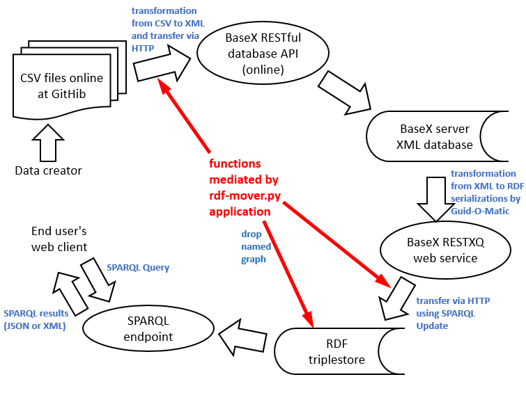
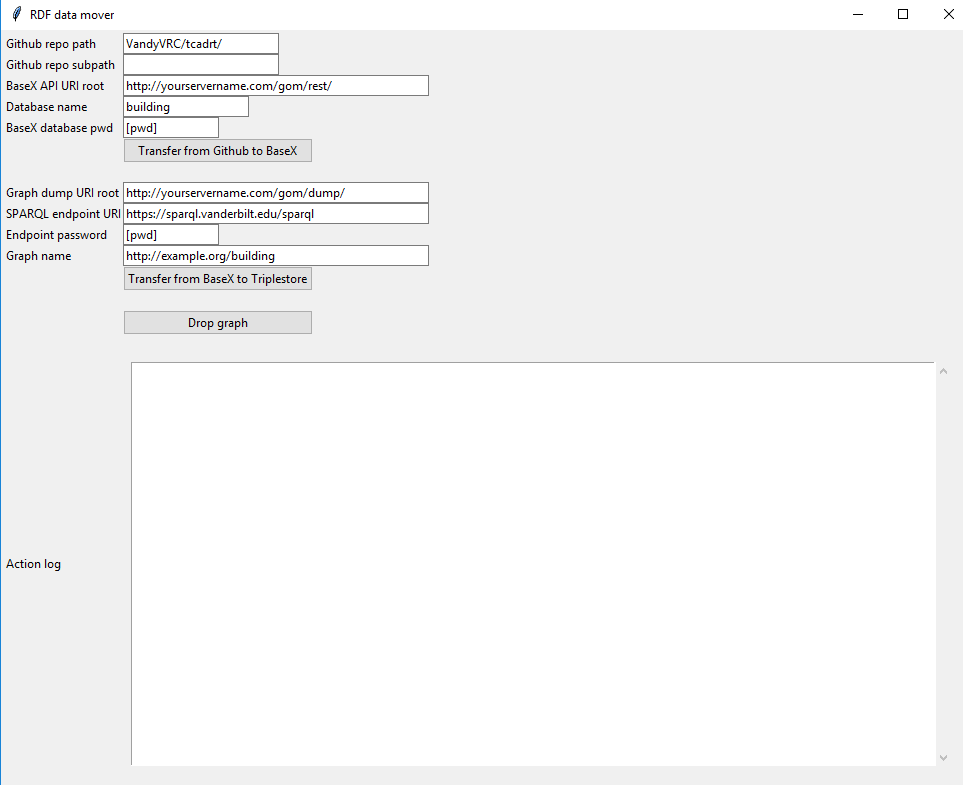

# Python application to manage generation and update of RDF datasets from CSV files on GitHub
**Steve Baskauf 2017-07-05**

[go to the rdf-mover.py script](rdf-mover.py)

[go to the Guid-O-Matic home page](README.md)

[go to the Vanderbilt SPARQL query interface](https://sparql.vanderbilt.edu)



# Purpose

Guid-O-Matic is a set of [XQuery](https://www.w3.org/TR/xquery-3/) modules that are designed to facilitate the transformation of data stored in CSV files into RDF triples.  These modules can be called by a [BaseX server](http://basex.org/products/server/) instance controlled by a [RESTXQ](http://exquery.github.io/exquery/exquery-restxq-specification/restxq-1.0-specification.html) running a [customized script](restxq-db.xqm) that sets up content-negotiation and handles various URI patterns (see [this blog post](http://baskauf.blogspot.com/2017/03/a-web-service-with-content-negotiation.html) for details). The XQuery functions called by the server script operate on XML databases whose XML files are analogs of the original CSV files.  One function of this Python application is to generate these XML files from CSV files on [GitHub](https://github.com/), then load them into the BaseX server database using the [BaseX database RESTful API](http://docs.basex.org/wiki/REST).

One option offered by the Guid-O-Matic based BaseX server is to produce a dump of the entire database as RDF in Turtle serialization when a particular URI is dereferenced. This makes it possible to load the RDF triples generated from a particular database into a named graph in a triplestore via HTTP using SPARQL Update.  That graph can then be queried via the SPARQL endpoint associated with the triplestore.  This Python script facilitates the transfer of the database dump to a named graph in a triplestore and also has an option to delete a particular named graph.  

Although the application is designed to facilitate transfer of data in a Guid-O-Matic/BaseX-based system, the SPARQL Update graph load function can be used to load any RDF data accessible via a URI (subject to the requirement that the source sends a Content-Type header for an appropriate RDF serialization, at least in the case of Blazagraph/Bigdata triplestores - see the comment under "Step 4" in [this blog post](http://baskauf.blogspot.com/2017/07/how-and-why-we-set-up-sparql-endpoint.html)).  

# Assumptions

- The data present in the CSV files are encoded in UTF-8 (or contain only ASCII characters, for which UTF-8 is backwardly compatible).  The column headers in the CSV files are [valid XML element names](https://www.w3schools.com/xml/xml_elements.asp).
- The six (or more) CSV files required for Guid-O-Matic are located in a single directory in the GitHub repo and that directory's name is then name you want to use for the database.  Oh noble user, please be clever and use only "safe" characters like lowercase letters, dashes ("-"), and underscores ("\_") in that database name!  Do otherwise at your own risk.  The software assumes that this folder is in the master branch - if you are accessing a different branch, you will need to hack the code appropriately.
- The username for all accounts is "admin" (hack the script if you want other options).
- You have Python3 installed on your computer and have installed the ["requests" Python package](http://docs.python-requests.org/en/master/) that facilitates HTTP requests. (I do not know how the script will behave under Python2.  It is likely that some parts of it will break, particularly reading and writing files using UTF-8.)



# Notes on using the application

The following notes discuss each of the text entry boxes and buttons on the application GUI:

1. Download the rdf-mover.py script [from GitHub](https://raw.githubusercontent.com/baskaufs/guid-o-matic/master/restxq-db.xqm) and put it somewhere where you can find it.
2. Run the script from the command line, or on a Windows computer, double-click on its icon (if Python3 isn't in your path variable, this might not work.)
3. The text boxes will have some values already loaded in them.  If you are going to use the application a lot, you will probably want to go into the script and change the default values in lines 29 to 95.
4. The Github repo path is the first part of the GitHub folder URI that makes it unique.  For example, if the CSV files are located in this folder: https://github.com/VandyVRC/tcadrt/tree/master/building, the value in the box should be "VandyVRC/tcadrt/" (with no leading forward slash but a trailing forward slash).  
5. The Github repo subpath will be empty if the folder containing the CSV files is a direct child of the master branch (as in the previous example).  However, if the folder containing the CSV files is farther down in the directory tree, then put a value in this box.  For example, if the URI of the folder containing the CSV files is https://github.com/HeardLibrary/semantic-web/tree/master/2016-fall/tang-song, then the subpath value would be "2016-fall/" (with no leading forward slash but a trailing forward slash).
6. The BaseX API URI root value is the URI of the BaseX server's database API.  For testing purposes, you can load data into a local installation of BaseX by using the BaseX API root http://localhost:8984/rest/ .  Instructions on starting a local HTTP BaseX server are [here](http://docs.basex.org/wiki/Startup).  Ctrl-C can be used at the command line to stop the server.  To watch what's happening in the server database, go to the Database Administration web GUI at http://localhost:8984/dba and log in once the server has been started.  
7. The Database name is the name of the folder on GitHub that contains the necessary CSV files.  In the example https://github.com/VandyVRC/tcadrt/tree/master/building, the database name is "building" and in the example https://github.com/HeardLibrary/semantic-web/tree/master/2016-fall/tang-song, the database name is "tang-song".  After the script transforms the CSV data files into analogous XML-formated files, it will load the XML files into a BaseX database having the same name as the GitHub folder (i.e. "building" and "tang-song" in the respective examples above).  The content, size, etc. of the database and files included in it can be monitored using the Database Administration web GUI.  That GUI can also be used to delete individual files, or to drop the entire database.  
8. The BaseX database pwd is "admin" by default, but can be changed using the BaseX Database Administration web GUI (under Jobs & Users, click on the user name).  The password is NOT hidden, so if somebody is looking over your shoulder who shouldn't see the password, don't type!
9. Clicking on the Transfer from Github to BaseX button causes several actions.  The first is to execute an HTTP PUT command that creates the database on the BaseX server.  If the database already exists, the data in it will be destroyed.  The second action is to initiate the reading from GitHub, transformation, and writing to BaseX of each of the individual data files that Guid-O-Matic needs to operate.  Each of these actions will show the HTTP response code (200 "OK" for successfully retrieving a file and 201 "Created" for successful file creation) and the URI of the resource involved.  Generally, the response body from the server will also be displayed if there is one.  In cases of failure (HTTP 4xx and 5xx codes), the response body may contain information useful for resolving the error.
10. The Graph dump URI root is the first part of the URL used to retrieve the RDF data.  The application forms the full URL by concatenating the Graph dump URI root to the Database name.  For example, if the Graph dump URI root is "http://yourservername.com/gom/dump/" and the Databse name is "building", then the full retrieval URL would be http://yourservername.com/gom/dump/building .  The full retrieval URL can be tested prior to use by entering it in a web browser address bar.  If the URL is good, the browser will either display the file on the screen, or download the file to the default download directory where you can examine it using a text editor.  **Note:**  The application can be hacked to load online RDF files other than Guid-O-Matic dumps if you break the file URL into two pieces and put them in the boxes.  For example, the file http://bioimages.vanderbilt.edu/thomas/0653-01.rdf can be loaded by entering "http://bioimages.vanderbilt.edu/thomas/" in the Graph dump URI root box and "0653-01.rdf" into the Database name box.  This would be a bad "real" database name, but fine if you just want to load a file into the triplestore.  **Note:** If hacked for this use, GitHub and Gist files will not load because GitHub does not send the files with the correct Content-Type headers.  See https://rawgit.com/ and "Step 4" in [this blog post](http://baskauf.blogspot.com/2017/07/how-and-why-we-set-up-sparql-endpoint.html) for more information.  **Note:** The Graph dump URI root cannot be a localhost: URI to a server installation on your local computer.  That's because the command to load from the URL is issued to a remote graph database server somewhere else on the Internet that cannot access your localhost: URL.  The Graph dump URI must be internet accessible.  (I have not experimented with cases where both the dump URI and endpoint URIs are localhost: URIs via different ports.)  
11. The SPARQL endpoint URI can be either a remote URI or a localhost: URI.  However, when making the HTTP POST to load the RDF into the triplestore, the application will carry out authentication using username "admin" and the password entered in the Endpoint password box.  I'm not sure what happens in that case if the endpoint does not require authentication.  
12. The Endpoint password is the one required for authentication on the server for the SPARQL endpoint.  This password is also NOT hidden.  
13. The Graph name is any valid URI that you want to use to identify the graph into which the RDF triples will be loaded.  The URI does not have to dereference - you can just make one up.  It is fine to dump more than one database graph into the same named graph.  If the graph does not already exist, it will be created.  Leaving the graph name blank is not recommended and may have unpredictable results.  
14. When the Transfer from BaseX to Triplestore button is clicked, the application will issue a [SPARQL Update](https://www.w3.org/TR/sparql11-update/) [LOAD](https://www.w3.org/TR/sparql11-update/#load) command via HTTP POST to the SPARQL endpoint designated in the SPARQL endpoint URI box.  The data will be loaded from the full retrieval URL (see item 10 above) and be inserted into the named graph designated in the Graph name box.  Depending on the amount of data to be loaded in the endpoint, there may be some delay before there are results shown in the Action log.  When loading into a Blazegraph/Bigdata triplestore, the important thing to note is the "mutationCount" shown in the response body.  The mutationCount will show the number of triples loaded into the graph.  Even if the HTTP response code is 200, there may have been no triples loaded into the graph of the mutationCount is zero.  
15. Clicking the Drop graph button causes the application to issue a SPARQL Update [DROP command](https://www.w3.org/TR/sparql11-update/#drop) for the graph whose URI is shown in the Graph name box.  It cannot be used to drop the default graph, or to execute DROP ALL. As with item 14, the mutationCount given in the response body in the Action log will show the number of triples removed from the triplestore.  If the mutationCount is zero, then nothing happened regardless of the HTTP status code.

In order to monitor the state of named graphs in the triplestore, the following SPARQL query can be executed (e.g. in the query box at http://sparql.vanderbilt.edu):
```
SELECT DISTINCT ?g WHERE {
graph ?g {?s ?p ?o}
}
```
Executing this query before and after loading or dropping graphs can confirm that the desired action has actually occurred.

For questions or comments, email [steve.baskauf@vanderbilt.edu](mailto:steve.baskauf@vanderbilt.edu?subject=rdf-mover).
